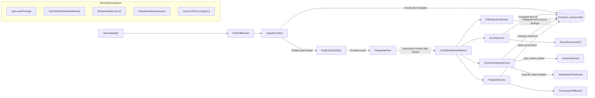

# Architecture Decisions

## Context

This system processes legal PDFs and must enforce privacy controls before any LLM analysis. The design prioritizes strong data handling guarantees, operational simplicity, and incremental rollout.

## Core Decisions

### 1) Serverless-First Runtime

- Use managed services first: Cloud Storage, Pub/Sub, Cloud Workflows, Cloud Run, Firestore.
- Avoid VM-based/self-managed orchestration.
- Benefit: lower ops overhead, easier scaling, cleaner IAM boundaries.

### 2) Privacy-First Processing

- Document AI extraction is followed by mandatory Cloud DLP redaction.
- Vertex AI Gemini receives **redacted text only**.
- Any non-redacted payload to analysis service is rejected by contract.
- Raw extracted text is treated as sensitive and should have strict retention and access controls.

### 3) Event-Driven Orchestration With Explicit Workflow

- Storage finalize event starts ingestion.
- Ingestion publishes job event to Pub/Sub.
- A bounded-concurrency dispatcher Cloud Run service reads from Pub/Sub and starts Cloud Workflows executions.
- Cloud Workflows executes a deterministic, step-based pipeline with retry semantics and built-in LRO polling.
- Firestore acts as source of truth for job status and audit fields.

### 4) Backpressure and Quota Resilience

- **Buffer:** Pub/Sub topic with 7-day retention puffers bursts. The pull subscription has `retry_policy`, dead-letter, and `enable_exactly_once_delivery`.
- **Backpressure:** The dispatcher Cloud Run service has `max_instance_count = 5` and `max_instance_request_concurrency = 1`. At most 5 workflow executions are started in parallel; the rest stays queued in Pub/Sub.
- **Async LRO for long documents:** The workflow calls Document AI `batchProcessDocuments` and polls operations until done. Long Gemini analyses route through Vertex AI Batch Prediction (GCS in/out, no HTTP timeout).
- **Gemini quota:** The `gemini-analysis` Cloud Run service has `max_instance_count = 5` and `max_instance_request_concurrency = 1`, capping concurrent Vertex calls. Service code applies exponential backoff on `RESOURCE_EXHAUSTED`.

### 5) Infrastructure as Code via Terraform

- All resources provisioned from `infra/terraform`.
- Reusable modules for storage, pubsub, firestore, iam, run services, workflows, monitoring, artifact_registry, docai, dlp, ingest_function, dispatcher_service.
- Document AI processor and DLP templates are Terraform-managed; no manual IDs in tfvars.
- GCS remote state: dev uses [`envs/dev/backend.tf`](infra/terraform/envs/dev/backend.tf). For prod, create a state bucket, copy [`envs/prod/backend.tf.example`](infra/terraform/envs/prod/backend.tf.example) to `backend.tf`, then `terraform init -migrate-state` as needed.

### 6) Least Privilege IAM

- Dedicated service account per runtime component (ingest, dispatcher, docai, dlp, gemini, finalize, workflow).
- Roles assigned per component scope only.
- CI uses Workload Identity Federation from GitHub OIDC (no static keys).
- Pub/Sub service agent has `iam.serviceAccountTokenCreator` on the dispatcher SA so Eventarc can mint OIDC tokens for Cloud Run pushes.

### 7) CI/CD Guardrails

- GitHub Actions runs Terraform checks/plans on push/PR to `main`.
- `service-build.yml` builds and pushes Cloud Run images to Artifact Registry on changes under `services/**`.
- Plan artifacts are retained for review/audit.
- On the default branch, require the `terraform-plan` and `service-ci` workflow checks to pass before merge. `service-build` runs on pushes to `main` when `services/**` changes (image deploy prerequisite).

## Data Flow

1. User uploads PDF to raw bucket.
2. Ingest function creates `contractJobs/{jobId}` record in Firestore.
3. Ingest function publishes `{jobId, source}` to Pub/Sub.
4. Dispatcher Cloud Run consumes (Eventarc push) and calls `workflows.executions.create`.
5. Workflow calls Document AI `batchProcessDocuments` (LRO) and polls until done.
6. Workflow calls DLP service to redact extracted text.
7. Workflow routes to Gemini sync or Vertex Batch Prediction based on `GEMINI_BATCH_CHAR_THRESHOLD`.
8. Finalizer moves PDF to processed bucket and marks job complete.

## Mermaid Architecture Diagram

## Observability

- Ingest and dispatcher emit **JSON logs** to stdout (`severity`, `message`, and correlating fields `jobId`, `executionName` on the dispatcher success path).
- Dev Terraform wires [`modules/monitoring`](infra/terraform/modules/monitoring): alerts on workflow **finished** executions with `FAILED` status and on Pub/Sub **dead-letter** message count for the jobs subscription. Optional notification channels: set `monitoring_notification_channel_ids` in dev tfvars.

## Integrator contract (API without UI)

- **Trigger:** Upload a PDF to the configured **raw** GCS bucket (object name must end in `.pdf`). Nothing in this repo exposes an HTTP upload API; any client or signed URL flow that lands files in that bucket is valid.
- **Correlation:** The ingest function creates `contractJobs/{jobId}` and publishes `jobId` plus `source` to Pub/Sub. There is **no** response body on the upload path with the job id; discover the job by listing/querying Firestore `contractJobs` (for example by `createdAt` or by matching `source.bucket` / `source.object`) or by following **structured logs** (`jobId` after publish, `executionName` after dispatch).
- **Initial Firestore fields** (ingest): `jobId`, `status` (`queued`), `createdAt` (RFC3339 nano UTC), `source` (`bucket`, `object`, optional `generation`). Later stages add pipeline-specific fields as services update the document.
- **Lifecycle:** `queued` → pipeline stages update the same document and object locations in GCS/Firestore until finalize marks completion (see Data Flow above). Polling Firestore by `jobId` is the supported integration pattern.
- **Not supported:** A single synchronous HTTP request that blocks until DocAI, DLP, and Gemini complete. Bursts are absorbed by Pub/Sub; long work uses LRO and batch paths inside Cloud Workflows.

## Non-Goals (Current Iteration)

- No direct end-user UI in this repository yet.
- No synchronous request/response processing path for the full pipeline.
- No custom model fine-tuning pipeline.
