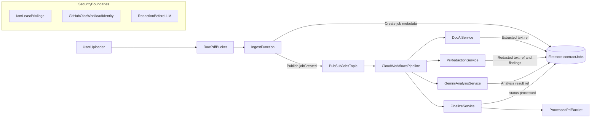

# Architecture Decisions

## Context

This system processes legal PDFs and must enforce privacy controls before any LLM analysis. The design prioritizes strong data handling guarantees, operational simplicity, and incremental rollout.

## Core Decisions

### 1) Serverless-First Runtime

- Use managed services first: Cloud Storage, Pub/Sub, Cloud Workflows, Cloud Run, Firestore.
- Avoid VM-based/self-managed orchestration.
- Benefit: lower ops overhead, easier scaling, cleaner IAM boundaries.

### 2) Privacy-First Processing

- Document AI extraction is followed by mandatory Cloud DLP redaction.
- Vertex AI Gemini receives **redacted text only**.
- Any non-redacted payload to analysis service is rejected by contract.
- Raw extracted text is treated as sensitive and should have strict retention and access controls.

### 3) Event-Driven Orchestration With Explicit Workflow

- Storage finalize event starts ingestion.
- Ingestion publishes job event to Pub/Sub.
- Cloud Workflows executes deterministic, step-based pipeline with retry semantics.
- Firestore acts as source of truth for job status and audit fields.

### 4) Infrastructure as Code via Terraform

- All resources provisioned from `infra/terraform`.
- Reusable modules for storage, pubsub, firestore, iam, run services, workflows, monitoring.
- Local backend used initially; switch to remote GCS backend once state bucket is ready.

### 5) Least Privilege IAM

- Dedicated service account per runtime component.
- Roles assigned per component scope only.
- CI uses Workload Identity Federation from GitHub OIDC (no static keys).

### 6) CI/CD Guardrails

- GitHub Actions runs Terraform checks/plans on push/PR to `main`.
- Plan artifacts are retained for review/audit.
- Branch protections should require Terraform plan job success.

## Data Flow

1. User uploads PDF to raw bucket.
2. Ingest function creates `contractJobs/{jobId}` record in Firestore.
3. Pub/Sub triggers workflow execution.
4. Document AI extracts text.
5. Cloud DLP redacts PII.
6. Gemini analyzes redacted text.
7. Finalizer moves PDF to processed bucket and marks job complete.

## Mermaid Architecture Diagram

## Non-Goals (Current Iteration)

- No direct end-user UI in this repository yet.
- No synchronous request/response processing path.
- No custom model fine-tuning pipeline.
